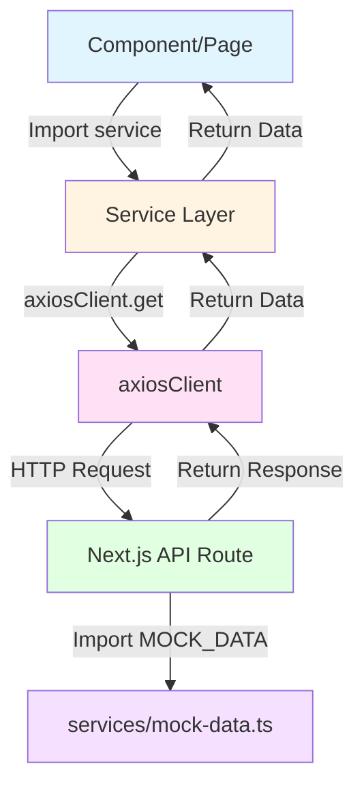

# Hướng Dẫn Chi Tiết: Refactor Từ Mock Data Trực Tiếp Sang Service Layer

## 📋 Mục Lục
1. [Tổng Quan](#tổng-quan)
2. [Phân Tích Hiện Trạng](#phân-tích-hiện-trạng)
3. [Kiến Trúc Mới](#kiến-trúc-mới)
4. [Hướng Dẫn Từng Bước](#hướng-dẫn-từng-bước)
5. [Ví Dụ Cụ Thể](#ví-dụ-cụ-thể)
6. [Testing](#testing)
7. [Troubleshooting](#troubleshooting)

---

## 🎯 Tổng Quan

### Mục Đích
Refactor ứng dụng từ việc gọi trực tiếp `MOCK_*` data sang sử dụng **Service Layer**, giúp:
- ✅ Dễ dàng chuyển sang Real Backend API trong tương lai
- ✅ Code sạch hơn, dễ bảo trì
- ✅ Tách biệt logic gọi API khỏi UI components
- ✅ Dễ dàng test và mock data

### Kiến Trúc Hiện Tại (Cũ)
```
Component/Page
    ↓
import { MOCK_MOVIES } from '@/services/mock-data'
    ↓
Sử dụng trực tiếp: MOCK_MOVIES.filter(...)
```

### Kiến Trúc Mới (Mục Tiêu)
```
Component/Page
    ↓
import { movieService } from '@/services'
    ↓
await movieService.getAll()
    ↓
axiosClient → /api/movies
    ↓
Next.js API Route Handler
    ↓
MOCK_MOVIES (hoặc Real Backend trong tương lai)
```

---

## 📊 Phân Tích Hiện Trạng

### Services Đã Có Sẵn ✅

Dự án đã có đầy đủ service layer trong `services/`:

| Service | File | Mục đích |
|---------|------|----------|
| `movieService` | `movieService.ts` | Quản lý API phim |
| `cinemaService` | `cinemaService.ts` | Quản lý API rạp chiếu |
| `showtimeService` | `showtimeService.ts` | Quản lý API suất chiếu |
| `roomService` | `roomService.ts` | Quản lý API phòng chiếu |
| `seatService` | `seatService.ts` | Quản lý API ghế ngồi |
| `foodService` | `foodService.ts` | Quản lý API đồ ăn |
| `voucherService` | `voucherService.ts` | Quản lý API voucher |
| `reviewService` | `reviewService.ts` | Quản lý API đánh giá |
| `eventService` | `eventService.ts` | Quản lý API sự kiện |
| `billService` | `billService.ts` | Quản lý API hóa đơn |
| `bookingService` | `bookingService.ts` | Quản lý API đặt vé |
| `accountService` | `accountService.ts` | Quản lý API tài khoản |
| `authService` | `authService.ts` | Đăng nhập/Đăng ký |
| `staffService` | `staffService.ts` | Quản lý API nhân viên |

**Ví dụ service đã có (`movieService.ts`):**
```typescript
import axiosClient from '@/lib/axiosClient';
import { Movie } from './types';

const movieService = {
  getAll: (): Promise<Movie[]> => {
    return axiosClient.get('/movies');
  },
  
  getById: (id: string): Promise<Movie> => {
    return axiosClient.get(`/movies/${id}`);
  },
  // ... các methods khác
};

export default movieService;
```

### Files Đang Gọi Mock Data Trực Tiếp ⚠️

#### **18 files cần refactor:**

##### 📄 User Pages (7 files)
1. **`app/movie/[id]/page.tsx`**
   - Gọi: `MOCK_SHOWTIMES`, `MOCK_REVIEWS`
   - Cần: `showtimeService.getByMovie()`, `reviewService.getByMovie()`

2. **`app/book-ticket/[id]/page.tsx`**
   - Gọi: `MOCK_SHOWTIMES`
   - Cần: `showtimeService.getById()`

3. **`app/cinemas/[id]/page.tsx`**
   - Gọi: `MOCK_CINEMAS`, `MOCK_SHOWTIMES`, `MOCK_ROOMS`
   - Cần: `cinemaService.getById()`, `showtimeService.getByCinema()`, `roomService.getByCinema()`

4. **`app/events/page.tsx`**
   - Gọi: `MOCK_EVENTS`
   - Cần: `eventService.getAll()`

5. **`app/promotions/page.tsx`**
   - Gọi: `MOCK_VOUCHERS`
   - Cần: `voucherService.getAll()`

6. **`app/account/profile/profile-content.tsx`**
   - Gọi: `MOCK_SHOWTIMES`, `MOCK_SEATS`, `MOCK_FOODS`
   - Cần: `showtimeService.getAll()`, `seatService.getAll()`, `foodService.getAll()`

7. **`app/account/order-history/order-history-list.tsx`**
   - Gọi: `MOCK_SHOWTIMES`, `MOCK_CINEMAS`
   - Cần: `showtimeService.getAll()`, `cinemaService.getAll()`

##### 🧩 Components (4 files)
8. **`components/showtime-selector.tsx`**
   - Gọi: `MOCK_CINEMAS`, `MOCK_ROOMS`

9. **`components/seat-selection.tsx`**
   - Gọi: `MOCK_SEATS`
   - Cần: `seatService.getByRoom()`

10. **`components/reviews.tsx`**
    - Gọi: `MOCK_REVIEWS`
    - Cần: `reviewService.getByMovie()`

11. **`components/food-selection.tsx`**
    - Gọi: `MOCK_FOODS`
    - Cần: `foodService.getAll()`

##### 👨‍💼 Admin Pages (3 files)
12. **`app/admin/dashboard/page.tsx`**
    - Gọi: `MOCK_MOVIES`, `MOCK_CINEMAS`, `MOCK_BILLS`

13. **`app/admin/showtimes/page.tsx`**
    - Gọi: `MOCK_CINEMAS`

14. **`app/admin/staff/page.tsx`**
    - Gọi: `MOCK_CINEMAS`

---

## 🏗️ Kiến Trúc Mới

### Luồng Dữ Liệu Mới



### Cấu Trúc Thư Mục Sau Khi Refactor

```
app/
├── api/                          # ← API Routes (NEW!)
│   ├── movies/
│   │   ├── route.ts             # GET /api/movies
│   │   └── [id]/
│   │       ├── route.ts         # GET /api/movies/:id
│   │       └── details/
│   │           └── route.ts     # GET /api/movies/:id/details
│   ├── showtimes/
│   │   ├── route.ts
│   │   └── [id]/
│   │       ├── route.ts
│   │       ├── details/
│   │       │   └── route.ts
│   │       └── seats/
│   │           └── route.ts
│   ├── cinemas/...
│   ├── rooms/...
│   ├── seats/...
│   └── ... (other resources)
│
├── movie/[id]/page.tsx          # ← Refactor để dùng services
├── book-ticket/[id]/page.tsx    # ← Refactor
└── ... (other pages)

services/
├── movieService.ts              # ✅ Đã có
├── cinemaService.ts             # ✅ Đã có
├── showtimeService.ts           # ✅ Đã có
├── mock-data.ts                 # Giữ nguyên, chỉ API routes dùng
└── index.ts                     # Xóa "export * from './mock-data'"

lib/
└── axiosClient.ts               # ✅ Đã có

components/
├── showtime-selector.tsx        # ← Refactor
├── seat-selection.tsx           # ← Refactor
└── ... (other components)
```

---

## 📝 Hướng Dẫn Từng Bước

### **BƯỚC 1: Tạo API Routes**

API Routes là nơi "phục vụ" mock data thông qua HTTP endpoints.

#### 1.1. Tạo API Route cho Movies

##### File: `app/api/movies/route.ts`
```typescript
import { NextResponse } from 'next/server';
import { MOCK_MOVIES } from '@/services/mock-data';

// GET /api/movies
export async function GET(request: Request) {
  try {
    // Giả lập network delay (optional)
    await new Promise(resolve => setTimeout(resolve, 300));
    
    // Có thể filter theo query params
    const { searchParams } = new URL(request.url);
    const status = searchParams.get('status'); // ?status=showing
    
    let movies = MOCK_MOVIES;
    
    if (status) {
      movies = movies.filter(m => m.status === status);
    }
    
    return NextResponse.json(movies);
  } catch (error) {
    return NextResponse.json(
      { error: 'Failed to fetch movies' },
      { status: 500 }
    );
  }
}
```

##### File: `app/api/movies/[id]/route.ts`
```typescript
import { NextResponse } from 'next/server';
import { MOCK_MOVIES } from '@/services/mock-data';

// GET /api/movies/:id
export async function GET(
  request: Request,
  { params }: { params: { id: string } }
) {
  try {
    const { id } = await params;
    const movie = MOCK_MOVIES.find(m => m.movie_id === id);
    
    if (!movie) {
      return NextResponse.json(
        { error: 'Movie not found' },
        { status: 404 }
      );
    }
    
    return NextResponse.json(movie);
  } catch (error) {
    return NextResponse.json(
      { error: 'Failed to fetch movie' },
      { status: 500 }
    );
  }
}
```

##### File: `app/api/movies/[id]/details/route.ts`
```typescript
import { NextResponse } from 'next/server';
import { getMovieWithDetails } from '@/services/mock-data';

// GET /api/movies/:id/details
// Trả về movie kèm theo directors, actors
export async function GET(
  request: Request,
  { params }: { params: { id: string } }
) {
  try {
    const { id } = await params;
    const movie = getMovieWithDetails(id);
    
    if (!movie) {
      return NextResponse.json(
        { error: 'Movie not found' },
        { status: 404 }
      );
    }
    
    return NextResponse.json(movie);
  } catch (error) {
    return NextResponse.json(
      { error: 'Failed to fetch movie details' },
      { status: 500 }
    );
  }
}
```

#### 1.2. Tạo API Route cho Showtimes

##### File: `app/api/showtimes/route.ts`
```typescript
import { NextResponse } from 'next/server';
import { MOCK_SHOWTIMES } from '@/services/mock-data';

// GET /api/showtimes
// Support query params: ?movie_id=xxx, ?cinema_id=xxx, ?date=xxx
export async function GET(request: Request) {
  try {
    const { searchParams } = new URL(request.url);
    const movie_id = searchParams.get('movie_id');
    const cinema_id = searchParams.get('cinema_id');
    const room_id = searchParams.get('room_id');
    const date = searchParams.get('date');
    
    let showtimes = MOCK_SHOWTIMES;
    
    if (movie_id) {
      showtimes = showtimes.filter(s => s.movie_id === movie_id);
    }
    
    if (cinema_id) {
      showtimes = showtimes.filter(s => s.cinema_id === cinema_id);
    }
    
    if (room_id) {
      showtimes = showtimes.filter(s => s.room_id === room_id);
    }
    
    if (date) {
      showtimes = showtimes.filter(s => 
        s.show_date_time.startsWith(date)
      );
    }
    
    return NextResponse.json(showtimes);
  } catch (error) {
    return NextResponse.json(
      { error: 'Failed to fetch showtimes' },
      { status: 500 }
    );
  }
}
```

##### File: `app/api/showtimes/[id]/route.ts`
```typescript
import { NextResponse } from 'next/server';
import { MOCK_SHOWTIMES } from '@/services/mock-data';

// GET /api/showtimes/:id
export async function GET(
  request: Request,
  { params }: { params: { id: string } }
) {
  try {
    const { id } = await params;
    const showtime = MOCK_SHOWTIMES.find(s => s.showtime_id === id);
    
    if (!showtime) {
      return NextResponse.json(
        { error: 'Showtime not found' },
        { status: 404 }
      );
    }
    
    return NextResponse.json(showtime);
  } catch (error) {
    return NextResponse.json(
      { error: 'Failed to fetch showtime' },
      { status: 500 }
    );
  }
}
```

##### File: `app/api/showtimes/[id]/seats/route.ts`
```typescript
import { NextResponse } from 'next/server';
import { MOCK_SEATS, MOCK_SHOWTIMES } from '@/services/mock-data';

// GET /api/showtimes/:id/seats
export async function GET(
  request: Request,
  { params }: { params: { id: string } }
) {
  try {
    const { id } = await params;
    
    // Tìm showtime để lấy room_id
    const showtime = MOCK_SHOWTIMES.find(s => s.showtime_id === id);
    
    if (!showtime) {
      return NextResponse.json(
        { error: 'Showtime not found' },
        { status: 404 }
      );
    }
    
    // Lấy seats của room đó
    const seats = MOCK_SEATS.filter(s => s.room_id === showtime.room_id);
    
    return NextResponse.json(seats);
  } catch (error) {
    return NextResponse.json(
      { error: 'Failed to fetch seats' },
      { status: 500 }
    );
  }
}
```

#### 1.3. Các API Routes Khác (Template)

Áp dụng pattern tương tự cho các resources khác:

- **Cinemas**: `app/api/cinemas/route.ts`, `app/api/cinemas/[id]/route.ts`
- **Rooms**: `app/api/rooms/route.ts`, `app/api/rooms/[id]/route.ts`
- **Seats**: `app/api/seats/route.ts` (hỗ trợ `?room_id=xxx`)
- **Foods**: `app/api/foods/route.ts`, `app/api/foods/[id]/route.ts`
- **Reviews**: `app/api/reviews/route.ts` (hỗ trợ `?movie_id=xxx`)
- **Vouchers**: `app/api/vouchers/route.ts`, `app/api/vouchers/[id]/route.ts`
- **Events**: `app/api/events/route.ts`, `app/api/events/[id]/route.ts`
- **Bills**: `app/api/bills/route.ts`, `app/api/bills/[id]/route.ts`
- **Accounts**: `app/api/accounts/[phone]/route.ts`

---

### **BƯỚC 2: Refactor Components/Pages**

#### 2.1. Server Component (Async/Await)

**Trước (app/movie/[id]/page.tsx):**
```typescript
import { getMovieWithDetails, MOCK_SHOWTIMES, MOCK_REVIEWS } from "@/services/mock-data";

export default async function MovieDetailPage({
  params,
}: {
  params: { id: string };
}) {
  const { id } = await params;
  
  const movie = getMovieWithDetails(id);
  const showtimes = MOCK_SHOWTIMES.filter((s) => s.movie_id === id);
  const reviewCount = MOCK_REVIEWS.filter((r) => r.movie_id === id).length;
  
  // ... render
}
```

**Sau:**
```typescript
import { movieService, showtimeService, reviewService } from '@/services';

export default async function MovieDetailPage({
  params,
}: {
  params: { id: string };
}) {
  const { id } = await params;
  
  // Gọi service thay vì MOCK data
  const movie = await movieService.getWithDetails(id);
  const showtimes = await showtimeService.getByMovie(id);
  const reviews = await reviewService.getByMovie(id);
  const reviewCount = reviews.length;
  
  // ... render
}
```

> **Lưu ý**: Với movieService.getWithDetails(), bạn cần thêm method này vào service:

```typescript
// services/movieService.ts
getWithDetails: (id: string): Promise<MovieWithDetails> => {
  return axiosClient.get(`/movies/${id}/details`);
},
```

#### 2.2. Client Component (useState + useEffect)

**Trước (components/reviews.tsx):**
```typescript
import { MOCK_REVIEWS } from "@/services/mock-data";

export function Reviews({ movie_id }: { movie_id: string }) {
  const movieReviews = MOCK_REVIEWS.filter((r) => r.movie_id === movie_id);
  
  return (
    <div>
      {movieReviews.map(review => (...))}
    </div>
  );
}
```

**Sau:**
```typescript
'use client';

import { useState, useEffect } from 'react';
import { reviewService } from '@/services';
import { Review } from '@/services/types';

export function Reviews({ movie_id }: { movie_id: string }) {
  const [reviews, setReviews] = useState<Review[]>([]);
  const [loading, setLoading] = useState(true);
  const [error, setError] = useState<string | null>(null);
  
  useEffect(() => {
    const fetchReviews = async () => {
      try {
        setLoading(true);
        const data = await reviewService.getByMovie(movie_id);
        setReviews(data);
      } catch (err) {
        setError('Không thể tải đánh giá');
        console.error(err);
      } finally {
        setLoading(false);
      }
    };
    
    fetchReviews();
  }, [movie_id]);
  
  if (loading) return <div>Đang tải đánh giá...</div>;
  if (error) return <div className="text-red-500">{error}</div>;
  
  return (
    <div>
      {reviews.map(review => (...))}
    </div>
  );
}
```

> **Thêm method vào reviewService.ts:**
```typescript
getByMovie: (movieId: string): Promise<Review[]> => {
  return axiosClient.get('/reviews', { params: { movie_id: movieId } });
},
```

#### 2.3. Component Nhận Props Từ Parent

Nếu parent đã fetch data, có thể truyền xuống qua props thay vì fetch lại.

**Trước (components/showtime-selector.tsx):**
```typescript
import { MOCK_CINEMAS, MOCK_ROOMS } from "@/services/mock-data";

export function ShowtimeSelector({ showtimes }: { showtimes: Showtime[] }) {
  // ...
  const cinema = MOCK_CINEMAS.find(c => c.cinema_id === cinema_id);
  const room = MOCK_ROOMS.find(r => r.room_id === showtime.room_id);
  // ...
}
```

**Sau (Option 1 - Fetch trong component):**
```typescript
'use client';

import { useState, useEffect } from 'react';
import { cinemaService, roomService } from '@/services';

export function ShowtimeSelector({ showtimes }: { showtimes: Showtime[] }) {
  const [cinemas, setCinemas] = useState<Cinema[]>([]);
  const [rooms, setRooms] = useState<Room[]>([]);
  
  useEffect(() => {
    const fetchData = async () => {
      const [cinemasData, roomsData] = await Promise.all([
        cinemaService.getAll(),
        roomService.getAll()
      ]);
      setCinemas(cinemasData);
      setRooms(roomsData);
    };
    fetchData();
  }, []);
  
  const cinema = cinemas.find(c => c.cinema_id === cinema_id);
  const room = rooms.find(r => r.room_id === showtime.room_id);
  // ...
}
```

**Sau (Option 2 - Nhận từ props, khuyến nghị):**
```typescript
interface Props {
  showtimes: Showtime[];
  cinemas: Cinema[];    // ← Parent fetch và truyền xuống
  rooms: Room[];        // ← Parent fetch và truyền xuống
}

export function ShowtimeSelector({ showtimes, cinemas, rooms }: Props) {
  const cinema = cinemas.find(c => c.cinema_id === cinema_id);
  const room = rooms.find(r => r.room_id === showtime.room_id);
  // ...
}
```

---

### **BƯỚC 3: Thêm Methods Thiếu Vào Services**

Một số methods có thể chưa có trong services, cần bổ sung:

#### Ví dụ: `movieService.ts`

```typescript
import axiosClient from '@/lib/axiosClient';
import { Movie, MovieWithDetails } from './types';

const movieService = {
  getAll: (): Promise<Movie[]> => {
    return axiosClient.get('/movies');
  },

  getById: (id: string): Promise<Movie> => {
    return axiosClient.get(`/movies/${id}`);
  },

  // ← THÊM METHOD NÀY
  getWithDetails: (id: string): Promise<MovieWithDetails> => {
    return axiosClient.get(`/movies/${id}/details`);
  },

  getNowShowing: (): Promise<Movie[]> => {
    return axiosClient.get('/movies', { params: { status: 'showing' } });
  },

  getUpcoming: (): Promise<Movie[]> => {
    return axiosClient.get('/movies', { params: { status: 'upcoming' } });
  },

  search: (keyword: string): Promise<Movie[]> => {
    return axiosClient.get('/movies/search', { params: { q: keyword } });
  },

  // Admin methods
  create: (data: Omit<Movie, 'movie_id'>): Promise<Movie> => {
    return axiosClient.post('/movies', data);
  },

  update: (id: string, data: Partial<Omit<Movie, 'movie_id'>>): Promise<Movie> => {
    return axiosClient.put(`/movies/${id}`, data);
  },

  delete: (id: string): Promise<void> => {
    return axiosClient.delete(`/movies/${id}`);
  },
};

export default movieService;
```

#### Các Methods Cần Thêm Vào Các Services Khác

##### `showtimeService.ts`
```typescript
getByMovie: (movieId: string): Promise<Showtime[]> => {
  return axiosClient.get('/showtimes', { params: { movie_id: movieId } });
},
```

##### `reviewService.ts`
```typescript
getByMovie: (movieId: string): Promise<Review[]> => {
  return axiosClient.get('/reviews', { params: { movie_id: movieId } });
},

create: (data: Omit<Review, 'review_id' | 'created_at'>): Promise<Review> => {
  return axiosClient.post('/reviews', data);
},
```

##### `seatService.ts`
```typescript
getByRoom: (roomId: string): Promise<Seat[]> => {
  return axiosClient.get('/seats', { params: { room_id: roomId } });
},
```

---

### **BƯỚC 4: Cleanup**

#### 4.1. Xóa Export Mock Data Từ services/index.ts

**File: `services/index.ts`**

**Trước:**
```typescript
// Export all services
export { default as movieService } from './movieService';
// ...

// Export all types
export * from './types';

// Re-export mock data for backward compatibility (will be removed when UI is migrated)
export * from './mock-data';  // ← XÓA DÒNG NÀY
```

**Sau:**
```typescript
// Export all services
export { default as movieService } from './movieService';
export { default as cinemaService } from './cinemaService';
export { default as showtimeService } from './showtimeService';
// ... (giữ nguyên)

// Export all types
export * from './types';

// ✅ Đã xóa export mock-data
```

#### 4.2. Kiểm Tra Không Còn Import MOCK_*

Chạy lệnh tìm kiếm:
```bash
# Tìm tất cả import MOCK_*
grep -r "MOCK_" app/ components/ --include="*.tsx" --include="*.ts"

# Hoặc
rg "import.*MOCK_" app/ components/
```

Nếu còn, refactor file đó.

---

## 💡 Ví Dụ Cụ Thể

### Ví Dụ 1: Refactor Movie Detail Page (Server Component)

#### File Cần Sửa: `app/movie/[id]/page.tsx`

**Code Cũ (139 dòng):**
```typescript
import { Badge } from "@/components/ui/badge";
import { ShowtimeSelector } from "@/components/showtime-selector";
import { RatingSummary } from "@/components/rating-summary";
import { Breadcrumb } from "@/components/breadcrumb";

import { getMovieWithDetails, MOCK_SHOWTIMES, MOCK_REVIEWS } from "@/services/mock-data";
// ↑ IMPORT MOCK DATA TRỰC TIẾP

export default async function MovieDetailPage({
  params,
}: {
  params: { id: string };
}) {
  const { id } = await params;

  const movie = getMovieWithDetails(id);
  const showtimes = MOCK_SHOWTIMES.filter((s) => s.movie_id === id);
  const reviewCount = MOCK_REVIEWS.filter((r) => r.movie_id === id).length;
  // ↑ SỬ DỤNG MOCK DATA

  // ... rest of component
}
```

**Code Mới:**
```typescript
import { Badge } from "@/components/ui/badge";
import { ShowtimeSelector } from "@/components/showtime-selector";
import { RatingSummary } from "@/components/rating-summary";
import { Breadcrumb } from "@/components/breadcrumb";

import { movieService, showtimeService, reviewService } from '@/services';
// ↑ IMPORT SERVICES

export default async function MovieDetailPage({
  params,
}: {
  params: { id: string };
}) {
  const { id } = await params;

  // GỌI SERVICES THAY VÌ MOCK DATA
  const movie = await movieService.getWithDetails(id);
  const showtimes = await showtimeService.getByMovie(id);
  const reviews = await reviewService.getByMovie(id);
  const reviewCount = reviews.length;

  if (!movie) {
    return (
      <div className="min-h-screen bg-background">
        <div className="mx-auto max-w-7xl px-6 py-8">
          <Breadcrumb items={[{ label: "Phim" }]} className="mb-8" />
          <div className="flex flex-col items-center justify-center py-20">
            <h1 className="text-2xl font-bold mb-4">Phim không tìm thấy</h1>
            <p className="text-muted-foreground">Không tìm thấy thông tin phim bạn đang tìm kiếm</p>
          </div>
        </div>
      </div>
    );
  }

  return (
    <div className="bg-background">
      {/* ... rest giữ nguyên ... */}
    </div>
  );
}
```

**API Route Cần Tạo:**

1. **`app/api/movies/[id]/details/route.ts`** (Đã có ở Bước 1)
2. **`app/api/showtimes/route.ts`** (Đã có ở Bước 1)
3. **`app/api/reviews/route.ts`**:

```typescript
import { NextResponse } from 'next/server';
import { MOCK_REVIEWS } from '@/services/mock-data';

export async function GET(request: Request) {
  try {
    const { searchParams } = new URL(request.url);
    const movie_id = searchParams.get('movie_id');
    
    let reviews = MOCK_REVIEWS;
    
    if (movie_id) {
      reviews = reviews.filter(r => r.movie_id === movie_id);
    }
    
    return NextResponse.json(reviews);
  } catch (error) {
    return NextResponse.json(
      { error: 'Failed to fetch reviews' },
      { status: 500 }
    );
  }
}
```

**Services Cần Cập Nhật:**

1. **`services/movieService.ts`** - Thêm `getWithDetails()`
2. **`services/showtimeService.ts`** - Thêm `getByMovie()` (có thể đã có)
3. **`services/reviewService.ts`** - Thêm `getByMovie()`

---

### Ví Dụ 2: Refactor Food Selection Component (Client Component)

#### File Cần Sửa: `components/food-selection.tsx`

**Code Cũ:**
```typescript
import { MOCK_FOODS } from "@/services/mock-data";

export function FoodSelection() {
  const [selectedFoods, setSelectedFoods] = useState<Record<string, number>>({});

  return (
    <div>
      {MOCK_FOODS.map((food) => {
        // ... render food item
      })}
    </div>
  );
}
```

**Code Mới:**
```typescript
'use client';

import { useState, useEffect } from 'react';
import { foodService } from '@/services';
import { Food } from '@/services/types';

export function FoodSelection() {
  const [foods, setFoods] = useState<Food[]>([]);
  const [loading, setLoading] = useState(true);
  const [selectedFoods, setSelectedFoods] = useState<Record<string, number>>({});

  useEffect(() => {
    const fetchFoods = async () => {
      try {
        const data = await foodService.getAll();
        setFoods(data);
      } catch (error) {
        console.error('Failed to fetch foods:', error);
      } finally {
        setLoading(false);
      }
    };

    fetchFoods();
  }, []);

  if (loading) {
    return <div className="text-center py-8">Đang tải danh sách đồ ăn...</div>;
  }

  return (
    <div>
      {foods.map((food) => {
        // ... render food item (giữ nguyên)
      })}
    </div>
  );
}
```

**API Route Cần Tạo:**

**`app/api/foods/route.ts`:**
```typescript
import { NextResponse } from 'next/server';
import { MOCK_FOODS } from '@/services/mock-data';

export async function GET() {
  try {
    return NextResponse.json(MOCK_FOODS);
  } catch (error) {
    return NextResponse.json(
      { error: 'Failed to fetch foods' },
      { status: 500 }
    );
  }
}
```

---

### Ví Dụ 3: Refactor Admin Dashboard (Server Component với Parallel Fetching)

#### File Cần Sửa: `app/admin/dashboard/page.tsx`

**Code Cũ:**
```typescript
import { MOCK_MOVIES, MOCK_CINEMAS, MOCK_BILLS } from "@/services/mock-data";

export default async function DashboardPage() {
  const stats = {
    totalMovies: MOCK_MOVIES.length,
    nowShowing: MOCK_MOVIES.filter((m) => m.status === "showing").length,
    comingSoon: MOCK_MOVIES.filter((m) => m.status === "upcoming").length,
    totalCinemas: MOCK_CINEMAS.length,
  };

  // ... render dashboard
}
```

**Code Mới (Parallel Fetching):**
```typescript
import { movieService, cinemaService, billService } from '@/services';

export default async function DashboardPage() {
  // Fetch parallel để nhanh hơn
  const [movies, cinemas, bills] = await Promise.all([
    movieService.getAll(),
    cinemaService.getAll(),
    billService.getAll(),
  ]);

  const stats = {
    totalMovies: movies.length,
    nowShowing: movies.filter((m) => m.status === "showing").length,
    comingSoon: movies.filter((m) => m.status === "upcoming").length,
    totalCinemas: cinemas.length,
  };

  // ... render dashboard (giữ nguyên)
}
```

---

## 🧪 Testing

### Manual Testing Checklist

Sau khi refactor từng file, test các chức năng:

#### User Flow Testing
- [ ] **Homepage**: Danh sách phim hiển thị đúng
- [ ] **Movie Detail**: Chi tiết phim, suất chiếu, reviews hiển thị
- [ ] **Booking**: Chọn suất chiếu → Chọn ghế → Chọn đồ ăn → Thanh toán
- [ ] **Cinemas**: Danh sách rạp, chi tiết rạp
- [ ] **Events**: Danh sách sự kiện
- [ ] **Promotions**: Danh sách voucher
- [ ] **Profile**: Thông tin cá nhân, lịch sử đặt vé

#### Admin Testing
- [ ] **Dashboard**: Statistics hiển thị chính xác
- [ ] **Manage Movies**: CRUD operations
- [ ] **Manage Showtimes**: CRUD operations
- [ ] **Manage Staff**: CRUD operations

### Automated Testing (Optional)

#### Test Service Functions

**File: `services/__tests__/movieService.test.ts`**
```typescript
import movieService from '../movieService';
import axiosClient from '@/lib/axiosClient';

jest.mock('@/lib/axiosClient');

describe('movieService', () => {
  it('should fetch all movies', async () => {
    const mockMovies = [{ movie_id: '1', name: 'Test Movie' }];
    (axiosClient.get as jest.Mock).mockResolvedValue(mockMovies);

    const result = await movieService.getAll();

    expect(axiosClient.get).toHaveBeenCalledWith('/movies');
    expect(result).toEqual(mockMovies);
  });
});
```

### Performance Testing

Kiểm tra network waterfall trong DevTools:
- Đảm bảo không có duplicate requests
- Server Components fetch parallel khi có thể
- Client Components có loading states

---

## 🔧 Troubleshooting

### Lỗi Thường Gặp

#### 1. **Cannot read property of undefined**

**Nguyên nhân**: Service trả về `undefined` hoặc `null`

**Giải pháp**:
```typescript
// Thêm error handling
const movie = await movieService.getById(id);

if (!movie) {
  return <div>Movie not found</div>;
}

// Hoặc optional chaining
<div>{movie?.name}</div>
```

#### 2. **CORS Error khi gọi API**

**Nguyên nhân**: axiosClient đang trỏ đến external URL

**Giải pháp**: Kiểm tra `.env.local`:
```bash
# Đảm bảo trỏ đến Next.js API Routes
NEXT_PUBLIC_API_URL=http://localhost:3000/api
```

#### 3. **Infinite Loop trong useEffect**

**Nguyên nhân**: Thiếu dependency array

**Giải pháp**:
```typescript
// SAI
useEffect(() => {
  fetchData();
}); // ← Thiếu []

// ĐÚNG
useEffect(() => {
  fetchData();
}, []); // ← Thêm dependency array
```

#### 4. **Build Error: Module not found**

**Nguyên nhân**: Import sai path

**Giải pháp**:
```typescript
// SAI
import { movieService } from '../services';

// ĐÚNG
import { movieService } from '@/services';
```

#### 5. **API Route trả về 404**

**Nguyên nhân**: Route không đúng hoặc file không đúng tên

**Kiểm tra**:
- File phải có tên `route.ts` (không phải `index.ts`)
- Folder structure đúng: `app/api/movies/route.ts`
- Export đúng HTTP method: `export async function GET() {}`

---

## 📚 Best Practices

### 1. Error Handling

Luôn có try-catch và hiển thị lỗi thân thiện:

```typescript
try {
  const data = await movieService.getAll();
  setMovies(data);
} catch (error) {
  console.error('Failed to fetch movies:', error);
  setError('Không thể tải danh sách phim. Vui lòng thử lại sau.');
}
```

### 2. Loading States

Hiển thị loading để UX tốt hơn:

```typescript
if (loading) {
  return <div className="flex justify-center py-8">
    <Spinner /> Đang tải...
  </div>;
}
```

### 3. TypeScript Types

Luôn định nghĩa types rõ ràng:

```typescript
const [movies, setMovies] = useState<Movie[]>([]);
//                                    ^^^^^^^^ Type annotation
```

### 4. Reusable Hooks (Optional)

Tạo custom hooks cho data fetching:

**File: `hooks/useMovies.ts`**
```typescript
import { useState, useEffect } from 'react';
import { movieService } from '@/services';
import { Movie } from '@/services/types';

export function useMovies() {
  const [movies, setMovies] = useState<Movie[]>([]);
  const [loading, setLoading] = useState(true);
  const [error, setError] = useState<string | null>(null);

  useEffect(() => {
    const fetchMovies = async () => {
      try {
        setLoading(true);
        const data = await movieService.getAll();
        setMovies(data);
      } catch (err) {
        setError('Failed to fetch movies');
      } finally {
        setLoading(false);
      }
    };

    fetchMovies();
  }, []);

  return { movies, loading, error };
}
```

**Sử dụng:**
```typescript
function MoviesPage() {
  const { movies, loading, error } = useMovies();

  if (loading) return <div>Loading...</div>;
  if (error) return <div>{error}</div>;

  return <div>{movies.map(...)}</div>;
}
```

---

## 🎯 Checklist Tổng Hợp

### Phase 1: API Routes
- [ ] Tạo API routes cho Movies
- [ ] Tạo API routes cho Showtimes
- [ ] Tạo API routes cho Cinemas
- [ ] Tạo API routes cho Rooms
- [ ] Tạo API routes cho Seats
- [ ] Tạo API routes cho Foods
- [ ] Tạo API routes cho Reviews
- [ ] Tạo API routes cho Vouchers
- [ ] Tạo API routes cho Events
- [ ] Tạo API routes cho Bills
- [ ] Tạo API routes cho Accounts
- [ ] Tạo API routes cho Staff
- [ ] Tạo API routes cho Bookings
- [ ] Test tất cả endpoints với Postman/Bruno

### Phase 2: Services
- [ ] Thêm methods thiếu vào movieService
- [ ] Thêm methods thiếu vào showtimeService
- [ ] Thêm methods thiếu vào reviewService
- [ ] Thêm methods thiếu vào seatService
- [ ] Thêm methods thiếu vào các services khác

### Phase 3: Refactor Pages
- [ ] app/movie/[id]/page.tsx
- [ ] app/book-ticket/[id]/page.tsx
- [ ] app/cinemas/[id]/page.tsx
- [ ] app/events/page.tsx
- [ ] app/promotions/page.tsx
- [ ] app/account/profile/profile-content.tsx
- [ ] app/account/order-history/order-history-list.tsx
- [ ] app/admin/dashboard/page.tsx
- [ ] app/admin/showtimes/page.tsx
- [ ] app/admin/staff/page.tsx

### Phase 4: Refactor Components
- [ ] components/showtime-selector.tsx
- [ ] components/seat-selection.tsx
- [ ] components/reviews.tsx
- [ ] components/food-selection.tsx

### Phase 5: Cleanup
- [ ] Xóa `export * from './mock-data'` trong services/index.ts
- [ ] Kiểm tra không còn import MOCK_* trực tiếp
- [ ] Run `npm run build` và fix errors
- [ ] Run `npm run lint` và fix warnings

### Phase 6: Testing
- [ ] Test user booking flow
- [ ] Test admin CRUD operations
- [ ] Test loading states
- [ ] Test error handling
- [ ] Performance check

---

## 🎓 Kết Luận

Sau khi hoàn tất refactor:

✅ **Code sạch hơn**: Không còn import `MOCK_*` rải rác
✅ **Dễ bảo trì**: Tất cả API calls tập trung ở services
✅ **Sẵn sàng cho Backend**: Chỉ cần đổi `NEXT_PUBLIC_API_URL` là xong
✅ **Better TypeScript**: Type-safe với tất cả API calls
✅ **Better UX**: Loading states và error handling đầy đủ

### Chuyển Sang Real Backend Sau Này

Khi backend team hoàn thành API, bạn chỉ cần:

1. **Cập nhật `.env.local`**:
```bash
# Cũ
NEXT_PUBLIC_API_URL=http://localhost:3000/api

# Mới
NEXT_PUBLIC_API_URL=https://api.your-backend.com/v1
```

2. **Xóa Next.js API Routes** (folder `app/api/`)

3. **Kiểm tra Response Format**: Nếu backend trả về khác, thêm adapter functions

4. **Deploy & Test**

**KHÔNG CẦN SỬA MỘT DÒNG CODE NÀO Ở COMPONENTS/PAGES!** 🎉

---

**Tài liệu này được cập nhật lần cuối: 2025-11-26**
